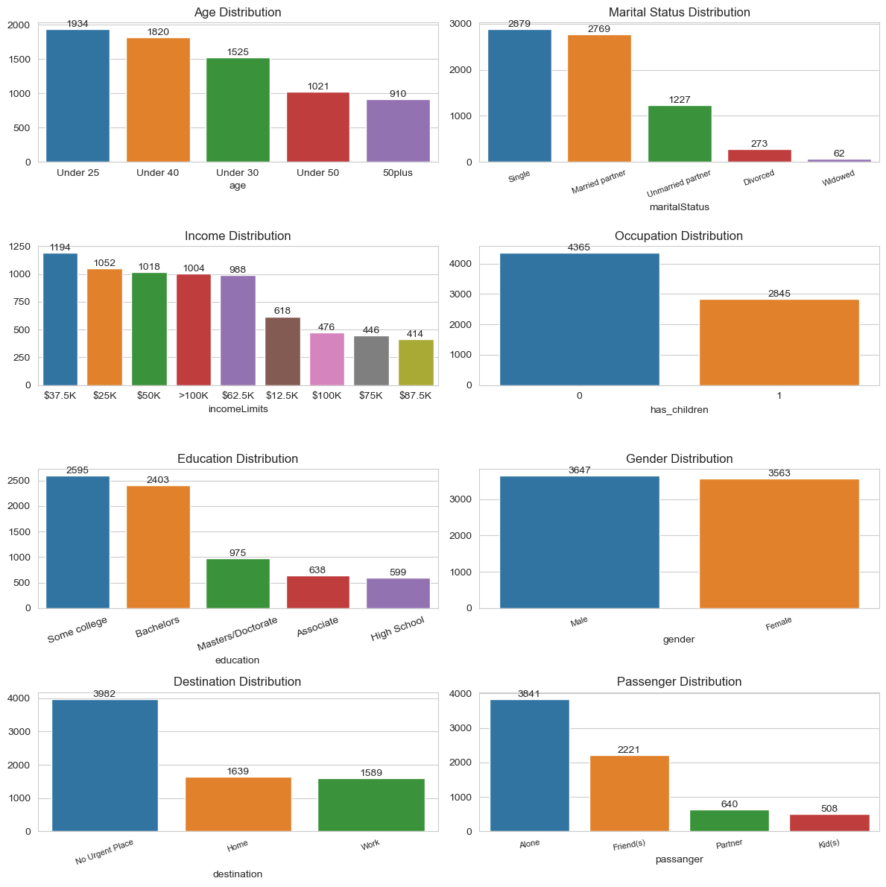
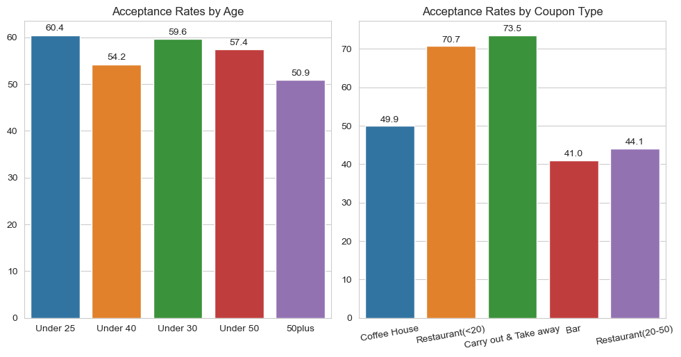
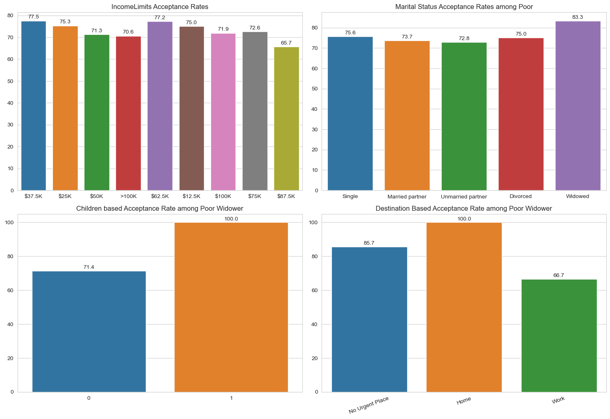

## Will the Customer Accept the Coupon?

As part of this exercise, I thoroughly examined the survey data, which delves into various driving scenarios such as destination, current time, weather, passengers, etc. Subsequently, respondents were asked whether they would accept a coupon if they were the driver. Leveraging this survey data, I conducted an analysis and prepared a concise report that underscores the disparities between customers who accepted the coupons and those who did not.

- Here is the [Survey Data](https://github.com/rameshrc/Coupon/blob/main/data/coupons.csv)
- Here is the [Notebook](https://github.com/rameshrc/Coupon/blob/main/prompt.ipynb)

## Cleaning up the Data

The survey data provided encompasses both user attributes and contextual attributes, providing valuable insights into user preferences. However, certain contextual attributes contain null values, necessitating data cleaning to replace these null values with appropriate alternatives. Additionally, some attribute values were excessively lengthy or complex, requiring cleaning procedures to streamline the data processing.

## Exploring the data

An in-depth examination of the characteristics of coupon users reveals some intriguing insights - 
* Individuals under 40 years old are the primary users of coupons.
* The majority are either single or in a relationship (married or otherwise).
* Their income generally falls below $62,500.
* Many have attended college, whether or not they have completed their degree.
* Users can be of any gender.
* Coupons are often redeemed during sunny weather, particularly in the afternoon when users are either heading home or do not have urgent plans.

I took a deep-dive into the coupon usage or acceptance data to enhance the study. 

Most popular coupons by Age Group along with their Acceptance Rate

| Age Group    | Coupon Type | Acceptance Rate |
| -------- | ------- | ------- |
| Under 25  | Restaurant(<20)    |74.0 |
| Under 30 | Carry out & Take away     |73.2|
| Under 40     | Carry out & Take away  |72.2|
| Under 50     | Restaurant(<20)  |72.7|
| 50plus    | Carry out & Take away  |77.5|

## Findings

Based on the observations, it is evident that coupons are predominantly used for takeout and less expensive dining establishments. We can delve deeper into the acceptance rate of coupons within the takeout and delivery segment. Our analysis will focus on the income levels of individuals who use this type of coupon, their marital status, and the times they most frequently redeem these coupons. Additionally, we will examine how the presence of children influences this choice.

### Coupons that are frequently redeemed for takeout and delivery exhibit the following traits -
- General Acceptance Rate: 0.74
- Most individuals in this category redeem these coupons three or more times.
- The demographic includes widowed individuals aged over 50.
- Families with children are more inclined to choose takeout options.
- This group generally falls within the lower income range.
- These coupons are mainly utilized when heading to their residence.